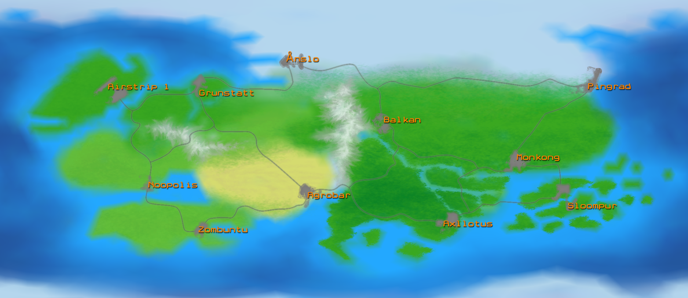
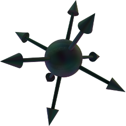

# Noocodex

OG Tatt is a top-down urban shoot-em-up set in a world where respect is is only the beginning.  
Players can play without joining an existing gang. Play on your own and create a gang with at least three people whenever you feel like it. You'll have to earn enough respect to get an HQ and to be mentioned.  
HQs 
   
## World

### Overview

### Regions

#### Western

* Grunstatt (Dutch/German/Danish) | **Hemp**
* Ånslo (Norwegian/Swedish/Finnish) | **Fish**
* Noopolis (Italian/Greek/French) | **Wine**
* Air Strip 1 (British/American) | **Telescreens**

#### Southern

* Zombuntu (Savannah) | **Wildlife**
* Agroban (Desert) | **Oil**
* Axllotus (Jungle) | **Natives**

#### Eastern

* Pingrad (Russian/North Korean) | **Communism**
* Balkan (Eastern European) | 
* Monkong (Chinese/Tibetan/Japanese) | **Pandas, robots and monks**
* Sloompur (Australian/Indonesian/New Zealand) | **Giant squids, small islands**

### Vehicles

 * Land
  - Cars
  - Motorcycles
  - Tanks
 * Water
  - Rowboats
  - Speedboats
  - Jet-skis

### Weapons

 + Pistol: Little Elvis
 + SMG: Spitfire
 + Mini-gun: Herzstark
 + Flamethrower: Libertorch
 + Rocket Launcher: Harab Shrapnels
 + Explosive Drones: Freedom Delivery System
 
### Gangs

Built-in gangs will include:

+ Emblem and colors (applied to HQ banners and vehicles)
+ Voices for both sexes
+ Limitations on clothing
+ Head quarters city block

-----------------------
 
#### Lagoonies

All these people became criminals overnight for sharing audio and decided to stop running. Now they are breaking all the other rules too.

##### Emblem
  
purple

-----------------------
 
#### X-Terminators

These androids from the recent past just got an unholy update from future Martian prankster ghosts. It makes these machines highly annoyed by all stuff that moves. Being unable to turn off their cameras, some have "lost" an arm.
 
##### Emblem

An angry looking robot posing as a red X.  
grey

-----------------------
 
#### Police Squad Now!

Spotting targets is so much easier when you're dressed in blue. And these people know it. Also recruiting new goons works better with a catchy name.

##### Emblem

A stylized burning book of law.  
blue

-----------------------
 
#### Tourists

Just enjoying their holiday in a country they love... no really!

##### Emblem

A camera and a pair of shades reflecting a mushroom cloud.  
white

-----------------------
 
#### Untied Morons o' Murky

A Christian biker gang, all that's left of a sunken empire. Stupidity is their motto, blindness their creed and think they're better then most people because Moron starts with "more".

##### Emblem

UMoM's logo is a vertically striped heart behind a ribbon saying "MoM" under a five-pointed star enclosing a U with a Celtic cross in the background.  
red

-----------------------

#### Chaos Squad

Everything is magic if you look at it that way.

##### Emblem

  
grey

-----------------------

#### Obscurinati

Having spent too much time in the dark these suits were cast back down to earth from their space thrones to fight for their life like any other mere mortal.

##### Emblem

Closed eye of providence.  
pink

-----------------------

#### Erisians

Hail Eris! Whatever that means

##### Emblem

A golden apple inscribed with the number 23.  
orange

-----------------------

#### SubGenii

Realizing they'll need to make some more noise if they want to reclaim the title of biggest religion, that's exactly what they'll do.

##### Emblem

"Bob".  
dark red

-----------------------

#### Bio-Front

Fight pollution, free animals, kill meat eaters.

##### Emblem

Boars head.  
bright Green

-----------------------

#### Association of Autonomous Astronauts

Trying to get into space they ran into a little budget problem.

##### Emblem

AAA.  
silver

-----------------------

# Gameplay

## Controls

 * `Enter`: Enter/Leave nearest vehicle on the most convenient side
 * `]`: Specifically enter/leave nearest vehicle on the right side
 * `[`: Specifically enter/leave nearest vehicle on the left side
 
## Hand-to-Hand combat

 + Disarm
 + Counter
 + Grab/Chokehold (PvP: buttonbash to break neck/free)
 
