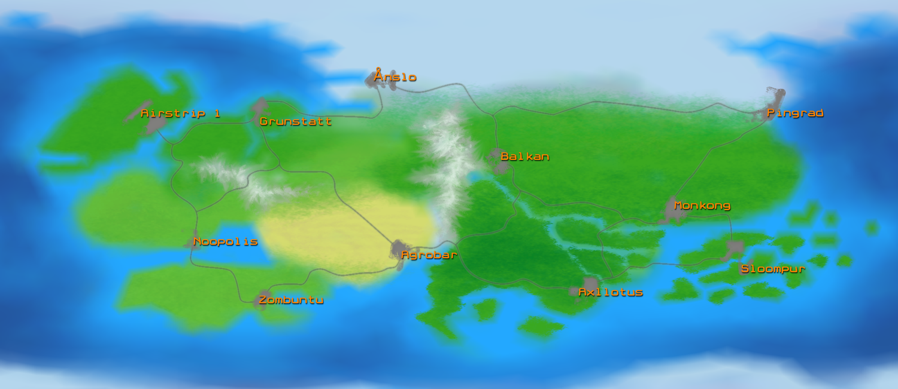

**OG Tatt** is a top-down urban shoot-em-up set in a world where respect is only the beginning. 
Players can play without joining an existing gang. Play on your own and create a gang with at least three people whenever you feel like it. You'll have to earn enough respect to get an HQ and to be mentioned.  
HQs 
 
# Gameplay

If you decide to join a gang you can either fight other gangs in each city or smuggle warez to other HQs of your gang in other cities.

## Controls

* Keyboard
   - `Enter`: Enter/Leave nearest vehicle on the most convenient side
   - `]`: Specifically enter/leave nearest vehicle on the right side
   - `[`: Specifically enter/leave nearest vehicle on the left side
 
## UI

+ Ability to create animated avatar from _building blocks_
+ Chat as pop-up with avatar and message for people on-screen and.
 
## Hand-to-Hand combat

+ Disarm
+ Counter
+ Grab/Chokehold (PvP: buttonbash to break neck/free)

-----------------------
   
## World

Cities and HQs are loaded from TMX files (Edddy EMP in the future). You need a vehicle to get to another city by road. Traveling to another city the camera angle changes and it is like a highway racing game during which you'll see the environment change in accordance with the climate and terrain.

### Overview

### Regions

#### Western

* **Grunstatt** (Dutch/German/Danish) | Hemp
* **Ånslo** (Norwegian/Swedish/Finnish) | Fishballs
* **Noopolis** (Italian/Greek/French) | Cheese, wine and philosophy
* **Airstrip 1** (British/American) | Telescreens

#### Southern

* **Zombuntu** (Savannah) | Wildlife and witchcraft
* **Agroban** (Desert) | Oil
* **Axllotus** (Jungle) | Natives

#### Eastern

* **Pingrad** (Russian/North Korean) | Communism
* **Balkan** (Eastern European) | 
* **Monkong** (Chinese/Tibetan/Japanese) | Pandas, robots and monks
* **Sloompur** (Australian/Indonesian/New Zealand) | Giant squids, small islands

### Vehicles

* Land
   - Cars
   - Motorcycles
   - Tanks
   - Boards

* Water
   - Rowboats
   - Speedboats
   - Jet-skis

### Weapons

##### Light weapons

+ Pistol: _Little Elvis_
+ SMG: _Spitfire_
+ Molotov cocktail

##### Heavy weapons

Slow you down, only one allowed.

+ Mini-gun: _Herzstark_
+ Flamethrower: _Libertorch_
+ Rocket Launcher: _Deathfist_
+ Explosive Drones: _Freedom Delivery System_
+ Electric arc: _Shocker_ (chains and revives fish)
 
### Gangs

For a list of built-in gangs see [Gangs.md](Gangs.md)

Built-in gangs will include:

+ Emblem and colors (applied to HQ banners and vehicles)
+ Voices for both sexes
+ Limitations on clothing
+ Head quarters city block

### Shops

- **Bonbon Ted** - chocolatier
- **Fresh Meat** - butcher
- **Them Apples** - grocery store
- **Big Cheeze** - cheese store
- **Hot Buns** - bakery

- **Fish van** (Western)
- **Lumpia trike** (Eastern)
- **Couche couche train** (Southern)

### Brands and commercials
Wulva - "Bil di papa"

### Inspiration

- GTA2
- Postal
- The Matrix
- Illuminatus Trilogy